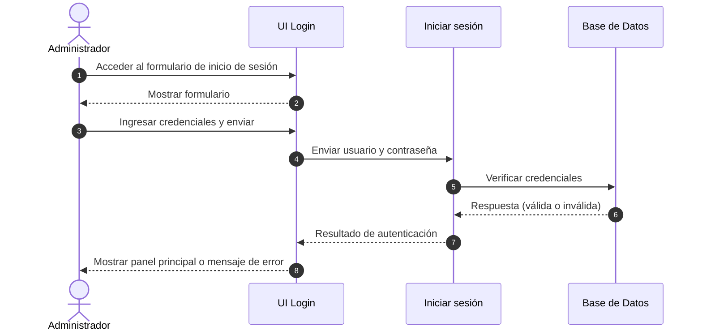
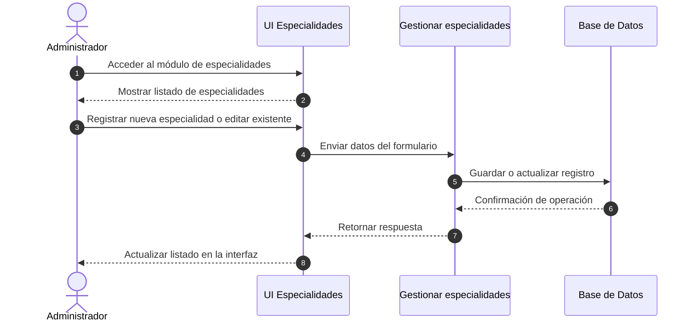
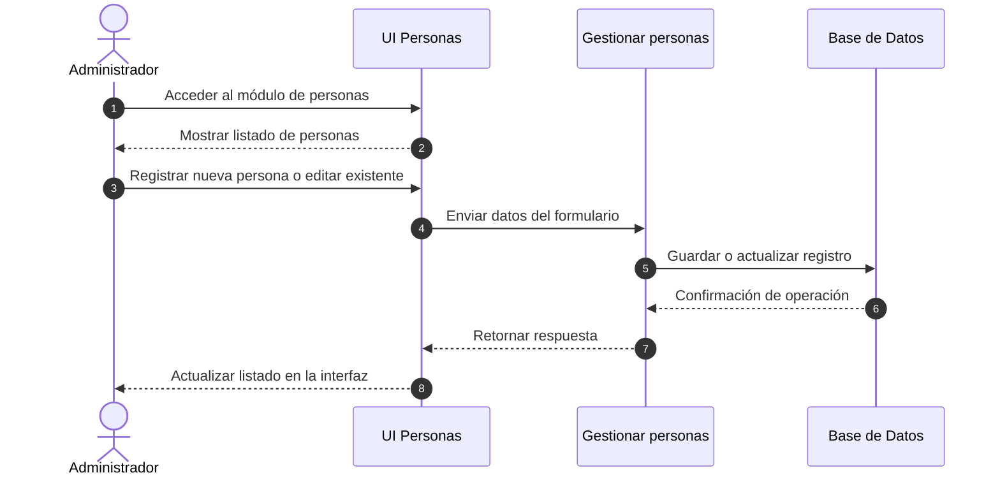
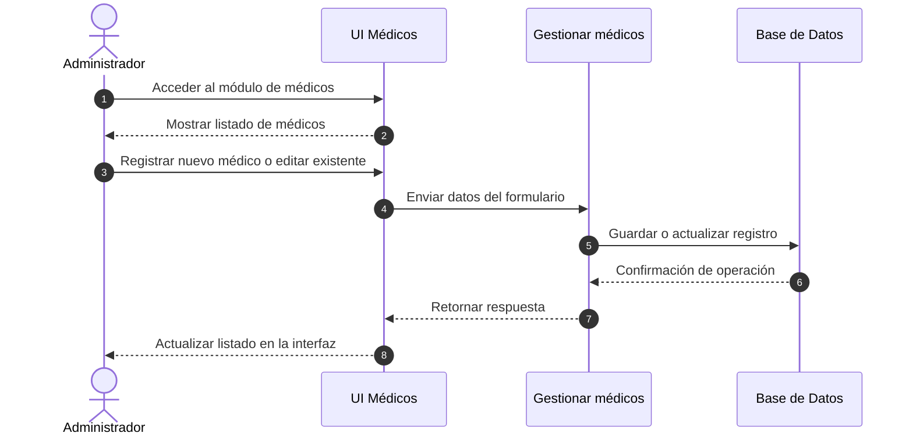
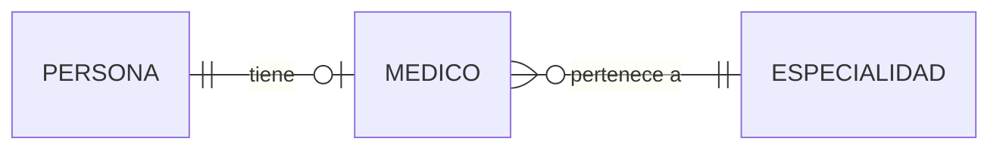
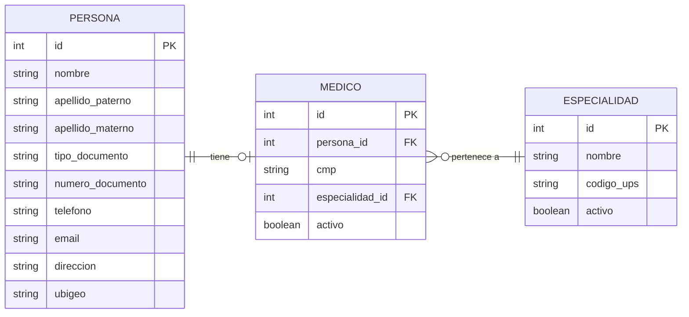
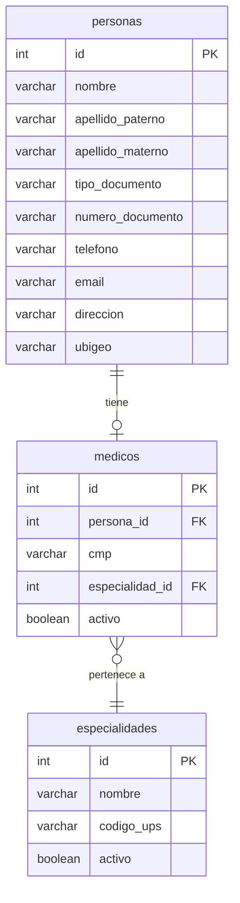

# proyecto-clt

```
composer require laravel/breeze --dev
php artisan breeze:install
npm install
npm run dev
php artisan migrate
```

```
php artisan migrate:fresh --seed
```

Figura X. Diagrama de secuencia – Iniciar sesión



Figura X+1. Diagrama de secuencia – Gestionar especialidades



Figura X+2. Diagrama de secuencia – Gestionar personas



Figura X+3. Diagrama de secuencia – Gestionar médicos



a) Modelo Conceptual
Figura X. Modelo Entidad-Relación Conceptual



Descripción: Este modelo muestra las entidades principales del sistema y sus relaciones fundamentales, sin detallar atributos ni claves. Se enfoca en representar las conexiones entre los elementos que componen la estructura general de la información.

b) Modelo Lógico
Figura X. Modelo Entidad-Relación Lógico



Descripción:
En este modelo se detallan los atributos clave de cada entidad, incluyendo claves primarias (PK) y foráneas (FK), permitiendo una visión técnica más precisa que sirve como base para el diseño físico de la base de datos.

c) Modelo Físico
Figura X. Modelo Entidad-Relación Físico



Descripción:
Representa la implementación de la base de datos con sus tablas, campos y relaciones, incluyendo los tipos de datos comúnmente usados. Refleja cómo será construida la estructura en un sistema de gestión de bases de datos relacional.

```

```

```

```
